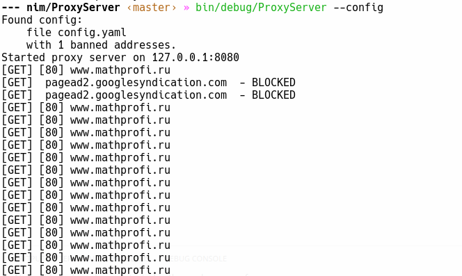

# proxy-server

Reversed http proxy server written in nim Made due to Internet Protocols course in second year study of Institute of Mathematics and Mechanics UrFU.

Work on: Linux, Windows.



## Install

Download binaries from [github release page](https://github.com/w1jtoo/watering-port/releases).

## Build
Proxy can be easy compiled by python build script:

```zsh
git clone https://github.com/w1jtoo/ProxyServer
cd ProxyServer
py build.py
```

Using only nim: 

``` zsh
nim c -d:ssl --debugger:native src/ProxyServer.nim
```

## Getting started


## Configuration

Run with configuration file using _--config_ run option:
```zsh
./ProxyServer --config
``` 

Now config.yaml 
